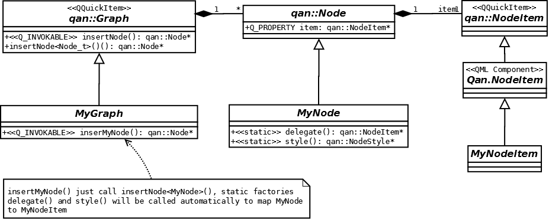

Advanced Use 
============================

Defining Custom Topology
------------------

QuickQanava topology is described using GTpo library. Topology is modelled using non visual objects modelling node ([qan::Node](http://www.destrat.io/quickqanava/doc/classqan_1_1_node.html)) connected by directed edges ([qan::Edge](http://www.destrat.io/quickqanava/doc/classqan_1_1_edge.html)) eventually grouped in [qan::Group](http://www.destrat.io/quickqanava/doc/classqan_1_1_group.html). These non-visual objects (called primitives) are mapped to QQuickItem based visual items. Concrete QQuickItem are generated on demand using QML QQmlComponent objects. 

QuickQanava provide default delegates for all primitives, but custom delegate could be specify by providing an argument for all primitive creation functions: `qan::Graph::insertNode()`, `qan::Graph::insertEdge()`, `qan::Graph::insertGroup()` and their QML counterpart in `Qan.Graph`. Simple custom delegate mapping is described in [QuickStart](http://www.destrat.io/quickqanava/gettingstarted/index.html#displaying-custom-nodes).

Primitives classes could be subclassed from c++ to provide specific customization. Mapping between non-visual topology primitive and their QtQuick counterpart is managed trought static singleton factories defined in qan::Node, qan::Edge and qan::Group. Theses factories are automatically called from qan::Graph when a primitive creation request happen: a visual item with a specific style is then automatically created.

Creation of a custom graph (MyGraph) with custom node (MyNode) and a dedicated visual item (MyNodeItem) could be achieved with the following architecture:



Factories have to be redefined in primitive subclasses:

  - `static  QQmlComponent*      delegate(QObject* caller) noexcept`: Return a (usually singleton) QML component that will be used for primitive visual delegate.
  - `static  qan::NodeStyle*     style() noexcept`: Return a (usually singleton) style used as primitive default style.

Custom content is then created from a specialized `qan::Graph` class:

``` cpp hl_lines="4"
// class MyGraph : public qan::Graph ...

qan::Node* MyGraph::insertMyNode() noexcept {
  return insertNode<MyNode>()
}
```

``` cpp 
// In a custom MyNode.cpp defining MyNode (inheriting from qan::Node)
static std::unique_ptr<QQmlComponent>   MyNode_delegate;
static std::unique_ptr<qan::NodeStyle>  MyNode_style;

QQmlComponent*  MyNode::delegate(QObject* caller) noexcept
{
    if ( !MyNode_delegate &&
         caller != nullptr ) {
        const auto engine = qmlEngine(caller);
        if ( engine != nullptr )
            CustomRectNode_delegate = std::make_unique<QQmlComponent>(engine, "qrc:/MyNode.qml");
        else qWarning() << "[static]MyNode::delegate(): Error: QML engine is nullptr.";
    }
    return CustomRectNode_delegate.get();
}

qan::NodeStyle* MyNode::style() noexcept
{
    if ( !MyNode_style ) {
        MyNode_style = std::make_unique<qan::NodeStyle>();
        MyNode_style->setBackColor(QColor("#ff29fc"));		// Initialize primitive default style here
    }
    return MyNode_style.get();
}
```

!!! note "Selection, visual connection and navigation will works out of the box for custom primitives (either nodes, edges or groups)."

Insertion of non Visual Content
------------------

Non visual edge or node could be used in graph to model complex topologies or add internal non-visual logic with:

- `qan::Graph::insertNonVisualNode<>()`: default graph `nodeDelegate` will no be used, custom node `delegate()` may be oeither undefined or return nullptr.
- `qan::Graph::insertNonVisualEdge<>(source, destination)`: Edge could be a regular node -> node edge or an oriented hyper edge node -> edge.


Observation of Topological Modifications
------------------

QuickQanava provide a full observation interface with the qan::Behaviour concept to react when underlying graph topology is modified. All primitives (nodes, edges or groups) could define custom behaviours to observe and react to topological changes.

- `qan::NodeBehaviour`: 

A behaviour could then be registered using: `registerBehaviour()` method in `qan::Node`.

``` cpp hl_lines="12 13"
#include <QuickQanava>

class CustomBehaviour : public qan::NodeBehaviour
{
  Q_OBJECT
public:
  explicit NodeBehaviour( QObject* parent = nullptr ) :
     qan::NodeBehaviour{ "Custom Behaviour", parent } { }
  virtual ~NodeBehaviour() { /* Nil */ } 
  NodeBehaviour( const NodeBehaviour& ) = delete;
protected:
  virtual void  inNodeInserted( qan::Node& inNode, qan::Edge& edge ) noexcept override;
  virtual void  inNodeRemoved( qan::Node& inNode, qan::Edge& edge ) noexcept override;
};
```

Such a custom node behaviour could be installed with the following code:

``` cpp hl_lines="4"
{
  qan::Graph graph;
  auto node = graph.insertNode();
  node->attachBehaviour( std::make_unique<CustomBehaviour>() );
  // node will now react when an in node is inserted or removed
  auto source = graph.insertNode();
  auto edge = graph.insertEdge(source, node);   // CustomBehaviour::Inserted() called
  graph.removeEdge(edge);						// CustomBehaviour::inNodeRemoved() called
}
```

Methods `inNodeInserted()` and `inNodeRemoved()` are called automatically when an in node is inserted or removed on behaviour target node.

Reference documentation:

  - [qan::NodeBehaviour](http://www.destrat.io/quickqanava/doc/classqan_1_1_node_behaviour.html)
  - [qan::Node::installBehaviour()](http://www.destrat.io/quickqanava/doc/classqan_1_1_node.html#af7f55d1894caae050bfdfc31d37166c3)
  
