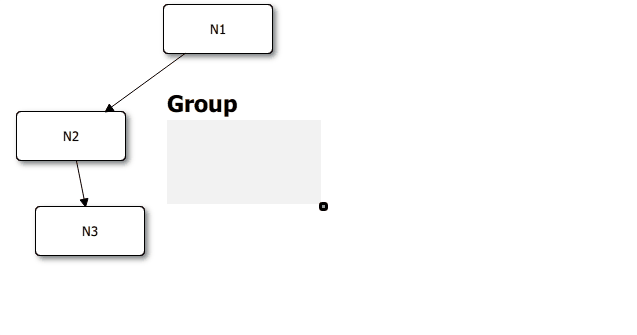

QuickQanava Quick Start 
============================

Installation
------------------

### Dependencies

| Dependency                | Mandatory         |   Included in source tree       |   Licence       |
| ---                       | :---:             | :---:                           | :---:           |
| GTpo                      | **Yes**           |       **Yes** (GIT submodule)   |      MIT        |
| Pugi XML                  | No                |       **Yes**                   |      MIT        |
| QuickProperties2          | **Yes**           |       **Yes** (GIT submodule)   |      LPGL       |
| Protocol Buffer v3        | No                |       No                        |    Permissive   |
| Google Test/Mock          | No                |       No                        |    Permissive   |

- **PugiXML** is released under an MIT licence, it is compatible with *GTpo* an is included directly in *GTpo* source tree. For more informations on PugiXML, see:
	- PugiXML homepage: http://pugixml.org/
	- PugiXML GitHub: https://github.com/zeux/pugixml

- **Protocol Buffer v3**: Protocol Buffer is used for binary serialization of graph, it is not a mandatory dependency, until you include the "qanSerializer.h" header. Protocol Buffer installation instructions can be found on:
	- Protocol Buffer homepage: https://developers.google.com/protocol-buffers/
	- Protocol Buffer v3 GitHub: https://github.com/google/protobuf

- **Google Test** is a *GTpo* dependency, it optionnal for QuickQanava until you intent to use a graph with custom non-STL/non-Qt containers:
	- Google Test GitHub: https://github.com/google/googletest/

### Building from sources

Get the latest QuickQanava sources:

```sh
git clone https://github.com/cneben/QuickQanava
cd QuickQanava
git submodule init
git submodule update
```

QuickQanava use _qmake_ as its main build configuration system, dependencies are configured in the root directory _common.pri_ file:
- For Linux, just install protocol buffer developper package and let the `common.pri` unmodified: `sudo apt-get install libprotobuf-dev`
- On Windows, follow the installation instructions from source from the Protocol Buffer homepage, then modify `common.pri` to point to your protobuf installation directory:

```sh
win32-msvc*:PROTOCOL_BUFFER3_DIR=C:/path/to/protobuf3
win32-msvc*:INCLUDEPATH     	+= $$PROTOCOL_BUFFER3_DIR\src
win32-msvc*:PROTOCOL_BUFFER3_LIBDIR_RELEASE  = $$PROTOCOL_BUFFER3_DIR/cmake/build/Release
win32-msvc*:PROTOCOL_BUFFER3_LIBDIR_DEBUG    = $$PROTOCOL_BUFFER3_DIR\cmake/build/Debug
```

The recommended way of using QuickQanava is to include the library directly as a GIT submodule in your project:

```sh
# Install QuickQanava as a GIT submodule
$ git submodule add https://github.com/cneben/QuickQanava
& git submodule update
```

Once GIT has finished downloading, QuickQanava and its dependencies ([GTpo](https://github.com/cneben/GTpo) and [QuickProperties](https://github.com/cneben/QuickProperties)) projects files could be included directly in your main qmake .pro file:

```sh
# in your project main .pro qmake configuration file
include($$PWD/QuickQanava/GTpo/src/gtpo.pri)
include($$PWD/QuickQanava/common.pri)
include($$PWD/QuickQanava/src/quickqanava.pri)
```

Samples
------------------

Displaying a Simple Directed Graph
------------------

Both QuickQanava and QuickProperties should be initialized in your c++ main function:

~~~~~~~~~~~~~{.cpp}
#include <QuickQanava>

 // _translator should be a scoped pointer member of your QQuickView:
    QScopedPointer< qps::AbstractTranslator > _translator{ new qps::AbstractTranslator() };
	
 // ...
 // In your custom QQuickView constructor:
    QuickProperties::initialize( engine(), _translator.data() );	// <--- translator could just be left to nullptr if you don't need internationalization
    QuickQanava::initialize();
~~~~~~~~~~~~~

Then, in QML import QuickQanava:
~~~~~~~~~~~~~{.cpp}
import QuickQanava 2.0 as Qan
import "qrc:/QuickQanava" as Qan
~~~~~~~~~~~~~

And create a `Qan.Graph` component:
~~~~~~~~~~~~~{.cpp}
Qan.Graph {
    id: graph
    anchors.fill: parent
    Component.onCompleted: {
        var n1 = graph.insertNode( )
        n1.label = "Hello World"
    }
}
~~~~~~~~~~~~~

Basic Graph Topology
------------------

A graph is "navigable" by default, it can be panned, zoomed and fit to view, this behaviour can be disabled by setting `Qan.Graph.navigable` property to false.

### Selection
   
Selection can be modified at graph level just by changing the graph selection policy property `Qan.Graph.selectionPolicy':
- `Qan.AbstractGraph.NoSelection`: Selection will be disabled in the whole graph.
- `Qan.AbstractGraph.SelectOnClick`: Node are selected when clicked, multiple selection is enabled when CTRL is pressed.
- `Qan.AbstractGraph.SelectOnCtrlClick`: Node are selected only if CTRL is pressed when node is clicked (multiple selection is still available).

Selection can also be configured with the following Qan.Graph properties:
- `Qan.Graph.selectionColor` / `qan::Graph::setSelectionColor()`: Color for the node selection rectangle.
- `Qan.Graph.selectionWeight` / `qan::Graph::setSelectionWeight()`: Border width of the node selection rectangle.
- `Qan.Graph.selectionMargin` / `qan::Graph::setSelectionMargin()`: Margin between the node selection rectangle and the node content (selection weight is taken into account).

All theses properties could be changed dynamically.

Selection could also be disabled at node level by setting `Qan.Node.selectable` to false, node become unselectable even if global graph selection policy is not set to `NoSelection`.

Current multiple selection (or single selection) is available trought Qan.Graph `selectedNodes` property. `selectedNodes` is a list model, it can be used in any QML view, or iterated from C++ to read the current selection:
~~~~~~~~~~~~~{.cpp}
// Viewing the actual selected nodes with a QML ListView:
ListView {
	id: selectionListView
	Layout.fillWidth: true; Layout.fillHeight: true
	clip: true
	model: graph.selectedNodes		// <---------
	spacing: 4; focus: true; flickableDirection : Flickable.VerticalFlick
	highlightFollowsCurrentItem: false
	highlight: Rectangle {
		x: 0; y: ( selectionListView.currentItem !== null ? selectionListView.currentItem.y : 0 );
		width: selectionListView.width; height: selectionListView.currentItem.height
		color: "lightsteelblue"; opacity: 0.7; radius: 5
	}
	delegate: Item {
		id: selectedNodeDelegate
		width: ListView.view.width; height: 30;
		Text { text: "Label: " + itemData.label }		// <----- itemData is a Qan.Node, node label could be accessed directly
		MouseArea {
			anchors.fill: selectedNodeDelegate
			onClicked: { selectedNodeDelegate.ListView.view.currentIndex = index }
		}
	}
}
~~~~~~~~~~~~~

In C++, `selectedNodes` could be iterated directly, the current node should be tested to ensure it is non nullptr, since the underlining model is thread-safe and could have
been modified from another thread:
~~~~~~~~~~~~~{.cpp}
	auto graph = std::make_unique<qan::Graph>();
    for ( auto& node : graph->getSelectNodes() ) {
        if ( node != nullptr )
            node->doWhateverYouWant();
    }
~~~~~~~~~~~~~

### Group topology

~~~~~~~~~~~~~{.cpp}
Qan.Graph {
  id: graph
  objectName: "graph"
  anchors.fill: parent

  Component.onCompleted: {
    var n1 = graph.insertNode( )
    n1.label = "N1"
    var n2 = graph.insertNode( )
    n2.label = "N2"
    var n3 = graph.insertNode( )
    n3.label = "N3"
    graph.insertEdge( n1, n2 )
    graph.insertEdge( n2, n3 )

    var gg = graph.insertGroup();
    gg.label = "Group"
  }
} // Qan.Graph: graph
~~~~~~~~~~~~~


### Using visual node connector


Displaying Custom Nodes
------------------


Defining Styles
------------------

Using Groups
------------------



Serializing Topology
-------------

Preferred way for dealing with persistance in QuickQanava is writing to Protocol Buffer repository with the qan::ProtoSerializer class:

1. Define a protobuf v3 message for your custom topology (usually a class inheriting from qan::Node)
2. Compile your message.
3. Register in/out functors in qan::ProtoSerializer to write your custom messages.
4. Call qan::ProtoSerializer saveGraphTo() or loadGraphFrom().

For example, if you have defined a custom "image node" called qan::ImageNode, write a protobuf3 message to store persistent data:
~~~~~~~~~~~~~{.cpp}
// File custom.proto
syntax = "proto3"; 
import "gtpo.proto";
import "quickqanava.proto";
package qan.pb;

message QanImgNode {
    .gtpo.pb.GTpoNode base=1;
    int32   img_data_size=4;
    bytes   img_data=5;
}
~~~~~~~~~~~~~

Compile this Protobuf IDL file with the following command:
~~~~~~~~~~~~~{.cpp}
$ protoc custom.proto --cpp_out=.
~~~~~~~~~~~~~

> Note: It might be necessary to manually copy "gtpo.proto" and "quickqanava.proto" in your .proto directory before calling `protoc`, theses files could be removed once custom.pb.cc and custom.pb.h have been generated.

You can then add `custom.pb.cc` and `custom.pb.h` to your qmake project configuration file, and register custom in/out functors in a qan::ProtoSerializer. Mapping between functors and the target node is done via the first string parameter of registerNodeOutFunctor(), the value must correspond to qan::Node::getDynamicClassName().

~~~~~~~~~~~~~{.cpp}
#include <QuickQanava>
 // ...
	QScopedPointer< qan::ProtoSerializer > _serializer{ new qan::ProtoSerializer() };
    engine()->rootContext( )->setContextProperty( "qanSerializer", _serializer.data() );
	
    _serializer->registerNodeOutFunctor( "qan::ImgNode",
                                         []( google::protobuf::Any* anyNodes,
                                         const qan::ProtoSerializer::WeakNode& weakNode,
                                         const qan::ProtoSerializer::NodeIdMap& nodeIdMap  ) {
            std::shared_ptr< qan::ImgNode > imageNode = std::static_pointer_cast< qan::ImgNode >( weakNode.lock() );
            if ( !imageNode )
                return;
	}
    _serializer->registerNodeInFunctor( []( const google::protobuf::Any& anyNode,
                                            qan::ProtoSerializer::Graph& graph,
                                            qan::ProtoSerializer::IdNodeMap& idNodeMap  ) -> qan::ProtoSerializer::WeakNode {
            if ( anyNode.Is< qan::pb::QanImgNode >() ) {
                qan::pb::QanImgNode pbImgNode;
                if ( anyNode.UnpackTo( &pbImgNode ) ) {
				}
			}
	}
~~~~~~~~~~~~~

See the topology sample for a compilable example.


