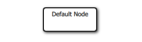
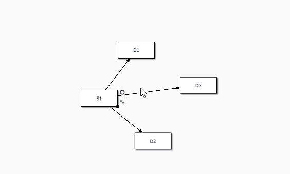
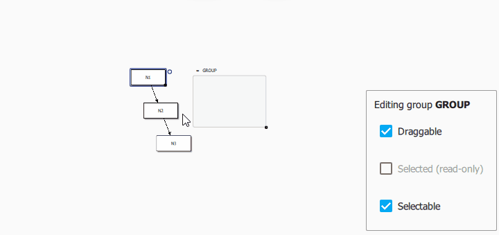

QuickQanava Quick Start 
============================

Simple Directed Graph
------------------

QuickQanava should be initialized in your c++ main function:

``` cpp hl_lines="9"
#include <QuickQanava>

int main(int argc, char *argv[])
{
    QGuiApplication app(argc, argv);
    QQuickStyle::setStyle("Material");
    QQmlApplicationEngine engine;
	// Or in a custom QQuickView constructor:
    QuickQanava::initialize();
	engine.load( ... );
    return app.exec();
}
```

Then, in QML import QuickQanava:
``` cpp
import QuickQanava 2.0 as Qan
import "qrc:/QuickQanava" as Qan
```

And create a `Qan.Graph` component:
``` cpp
Qan.Graph {
    id: graph
    anchors.fill: parent
    Component.onCompleted: {
        var n1 = graph.insertNode()
        n1.label = "Hello World"
    }
}
```

Topology
------------------

### Adding content

Content could initialized in graph `onCompleted()` function:

- `Qan.Node Qan.Graph.insertNode()`: 
- `Qan.Edge Qan.Graph.insertEdge(Qan.Node, Qan.Node)`:
- `Qan.Group Qan.Graph.insertGroup()`:

``` cpp hl_lines="5"
Qan.Graph {
    id: graph
    anchors.fill: parent
    Component.onCompleted: {
        var n1 = graph.insertNode()
        n1.label = "Default Node"
		n1.item.x = 50; n1.item.y = 50
    }
}
```



### Navigation

A graph is not "navigable" by default, to allow navigation using mouse panning and zooming, `Qan.Graph` component must be defined in the `graph` property of a `Qan.GraphView` component:

``` cpp hl_lines="5"
Qan.GraphView {
  id: graphView
  anchors.fill: parent
  navigable   : true
  graph: Qan.Graph {
      id: topology
    } // Qan.Graph: topology
} // Qan.GraphView
```

Navigation could be disabled by setting the `navigable` property to false (it default to true).

### Visual connection of nodes

QuickQanava allow visual connection of node with the `Qan.VisualConnector` component. Default visual connector is configured in `Qan.Graph` component using the following properties:

- `Qan.Graph.connectorEnabled` (bool): Set to true to enable visual connection of nodes (default to false).

- `Qan.Graph.connectorEdgeColor` (color): Set the visual connector preview edge color (useful to have Light/Dark theme support, default to black).

- `Qan.Graph.connectorCreateDefaultEdge` (bool, default to true): When set to false, default visual connector does not use Qan.Graph.insertEdge() to create edge, but instead emit `connectorRequestEdgeCreation()` signal to allow user to create custom edge be calling a user defined method on graph (`connectorEdgeInserted()` is not emitted).

``` cpp hl_lines="5"
Qan.GraphView {
  id: graphView
  anchors.fill: parent
  graph : Qan.Graph {
    connectorEnabled: true
	connectorEdgeInserted: console.debug( "Edge inserted between " + src.label + " and  " + dst.label)
	connectorEdgeColor: "violet"
	connectorColor: "lightblue"
  } // Qan.Graph
} // Qan.GraphView
```


The following notifications callbacks are available:

- Signal `Qan.Graph.connectorEdgeInserted(edge)`: Emitted when the visual connector has been dragged on a destination node or edge to allow specific user configuration on created edge.

- Signal `Qan.Graph.connectorRequestEdgeCreation(src, dst)`: Emitted when the visual connector is dragged on a target with `createDefaultEdge` set to false: allow creation of custom edge (or any other action) by the user. Example:

``` cpp hl_lines="8"
Qan.GraphView {
  id: graphView
  anchors.fill: parent
  graph : Qan.Graph {
    id: graph
    connectorEnabled: true
	connectorCreateDefaultEdge: false
	onConnectorRequestEdgeCreation: { 
	  // Do whatever you want here, for example: graph.insertEdge(src, dst)
	}
  } // Qan.Graph
} // Qan.GraphView
```

Reference documentation: [qan::Connector interface](http://www.destrat.io/quickqanava/doc/classqan_1_1_connector.html) and [Qan.VisualConnector component](http://www.destrat.io/quickqanava/doc/class_visual_connector.html). See also [qan::Graph](http://www.destrat.io/quickqanava/doc/classqan_1_1_graph.html) "Visual Connection Management" section.

Default connector component `Qan.Graph.connector` could be replaced by a user defined `Qan.VisualConnector` to customize connector behavior in more depth. It is possible to add multiple visuals connectors on the same node, using a connector to generate specific topologies (create edges with different concrete types) or select targets visually. Such an advanced use of custom connectors is demonstrated in 'connector' sample: [https://github.com/cneben/QuickQanava/tree/master/samples/connector](https://github.com/cneben/QuickQanava/tree/master/samples/connector)



### Resizing

Default resizing behaviour could be configured in `Qan.GraphView` using the following properties:

- `resizeHandlerColor` (color): Color of the visual drop node component (could be set to Material.accent for example)

Node could be resized using the `Qan.BottomRightResizer` component. 

Selection
------------------
   
Selection can be modified at graph level just by changing the graph selection policy property `Qan.Graph.selectionPolicy`:

- `Qan.AbstractGraph.NoSelection`: Selection will be disabled in the whole graph.
- `Qan.AbstractGraph.SelectOnClick`: Node are selected when clicked, multiple selection is enabled when CTRL is pressed.
- `Qan.AbstractGraph.SelectOnCtrlClick`: Node are selected only if CTRL is pressed when node is clicked (multiple selection is still available).

Selection can also be configured with the following Qan.Graph properties:

- `Qan.Graph.selectionColor` / `qan::Graph::setSelectionColor()`: Color for the node selection rectangle.
- `Qan.Graph.selectionWeight` / `qan::Graph::setSelectionWeight()`: Border width of the node selection rectangle.
- `Qan.Graph.selectionMargin` / `qan::Graph::setSelectionMargin()`: Margin between the node selection rectangle and the node content (selection weight is taken into account).

All theses properties could be changed dynamically.

Selection could also be disabled at node level by setting `Qan.Node.selectable` to false, node become unselectable even if global graph selection policy is not set to `NoSelection`.

Current multiple selection (or single selection) is available through Qan.Graph `selectedNodes` property. `selectedNodes` is a list model, it can be used in any QML view, or iterated from C++ to read the current selection:
``` cpp hl_lines="6"
// Viewing the currently selected nodes with a QML ListView:
ListView {
	id: selectionListView
	Layout.fillWidth: true; Layout.fillHeight: true
	clip: true
	model: graph.selectedNodes		// <---------
	spacing: 4; focus: true; flickableDirection : Flickable.VerticalFlick
	highlightFollowsCurrentItem: false
	highlight: Rectangle {
		x: 0; y: ( selectionListView.currentItem !== null ? selectionListView.currentItem.y : 0 );
		width: selectionListView.width; height: selectionListView.currentItem.height
		color: "lightsteelblue"; opacity: 0.7; radius: 5
	}
	delegate: Item {
		id: selectedNodeDelegate
		width: ListView.view.width; height: 30;
		Text { text: "Label: " + itemData.label }		// <----- itemData is a Qan.Node, node 
														// label could be accessed directly
		MouseArea {
			anchors.fill: selectedNodeDelegate
			onClicked: { selectedNodeDelegate.ListView.view.currentIndex = index }
		}
	}
}
```

In C++, `selectedNodes` could be iterated directly, the current node should be tested to ensure it is non nullptr, since the underlining model is thread-safe and could have been modified from another thread:
``` cpp
	auto graph = std::make_unique<qan::Graph>();
    for ( auto& node : graph->getSelectNodes() ) {
        if ( node != nullptr )
            node->doWhateverYouWant();
    }
	// Or better:
    for ( const auto& node : qAsConst(graph->getSelectNodes()) ) {
        if ( node != nullptr )
            node->doWhateverYouWantConst();
    }
```

Example of `Qan.AbstractGraph.SelectOnClick` selection policy with multiple selection dragging inside a group:


Using Groups
------------------



``` cpp
Qan.Graph {
  id: graph
  objectName: "graph"
  anchors.fill: parent

  Component.onCompleted: {
    var n1 = graph.insertNode( )
    n1.label = "N1"
    var n2 = graph.insertNode( )
    n2.label = "N2"
    var n3 = graph.insertNode( )
    n3.label = "N3"
    graph.insertEdge( n1, n2 )
    graph.insertEdge( n2, n3 )

    var gg = graph.insertGroup();
    gg.label = "Group"
  }
} // Qan.Graph: graph
```


Displaying Custom Nodes
------------------

See the `custom.qml` file in `nodes` sample for more informations on specifying custom delegates for nodes and edges.

When defining custom nodes with complex geometry (ie. non rectangular), there is multiple ways to take bounding shape generation into account :
  
  - Using the default behavior for rectangular node with `complexBoundingShape` set to false (default value), bounding shape is automatically generated on node width or height change in `generateDefaultBoundingShape()`.
  
  - Using dedicated code by setting `complexBoundingShape` to true and with a call to \c setBoundingShape() from a custom onRequestUpdateBoundingShape() signal handler.

Note that signal `requestUpdateBoundingShape` won't be emitted for non complex bounding shape. Optionally, you could choose to set complexBoundingShape to false and override `generateDefaultBoundingShape()` method.

Defining Styles
------------------


