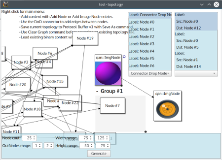
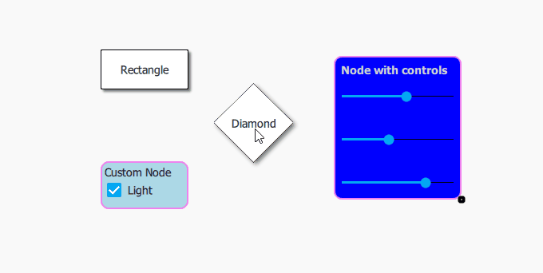
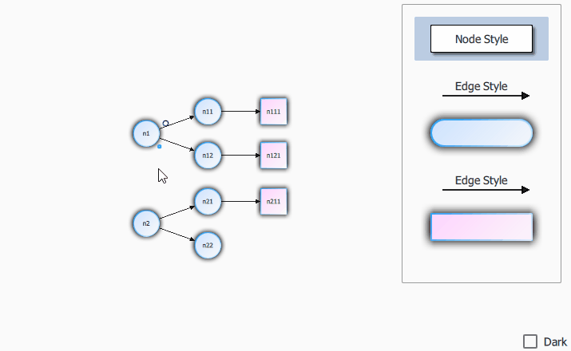
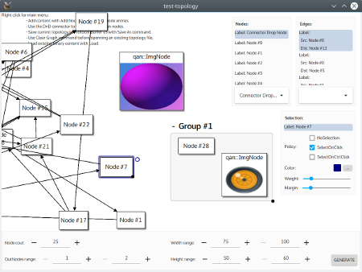

!!! warning "QuickQanava is alpha, interface may change before 1.0.0 release, but QuickQanava is already used extensively in production code." 

!!! note "QuickQanava is licensed under LGPL (GTpo library is MIT), low-cost commercial license with more sample code, Protocol Buffer and No-SQL persistence support is available on demand: contact@destrat.io"

`QuickQanava` is a C++14 library designed to display graphs and relational content in a QtQuick application using QML code. QuickQanava provide components and classes to visualize medium-sized directed graphs in a QML application. QuickQanava does not provide advanced layout algorithms, but rather focus on displaying relational content in an advanced dynamic user interface (with DnD support, resizable content, visual connection of nodes).

`QuickQanava` is released under LGPL v3, and is shipped with *[GTpo](https://github.com/cneben/GTpo)* library (MIT licence), *[QuickContainers](https://github.com/cneben/QuickQanava/tree/master/QuickContainers)* (LGPL) and *[QuickGeoGL](https://github.com/cneben/QuickQanava/tree/master/QuickGeoGL)*.

QuickQanava main repository is hosted on GitHub: https://github.com/cneben/quickqanava

QuickQanava is primarily developed with Qt >= 5.7 with MSVC2015 and g++5.4 (Minimal version number for Qt is 5.7, some samples may need the latest QuickControls2 from Qt 5.8)

+ Project homepage: [http://www.destrat.io/quickqanava](http://www.destrat.io/quickqanava)
+ Reference documentation: [http://www.destrat.io/qanava/doc/index.html](http://www.destrat.io/qanava/doc/index.html)

## RoadMap

  - **v0.8.0: Complex topologies** (_20170322_ master is 0.8.0 beta)
    - GTpo (Configurable topology library):
      - [X] Redesign and optimize GTpo generic containers accessors.
      - [X] Add complex topologies support: full restricted hyper edge, group -> node and group -> group topologies.
	  - [X] Remove any virtual overhead from GTpo.
	  - [ ] Push test coverage to 100% (ie increase coverage for subgroups).- [80%] Redesign qan::Graph interface for creating content.
	  - [X] Remove protocolbuffer and properties management support (it has nothing to do in the visualization package).
    - [X] Redesign qan::Graph interface for creating content.
      - [ ] Add a 100% C++ interface (currently QML delegate components definition still are necessary).
        - [ ] Publish the 4k sample (40k is probably too much for QML without dedicated culling and LOD code).
    - [50%] Add _efficient_ support for non visual nodes and edges, non visual edges should have a very small footprint (ie non QQuickItem...).
    - [X] Update samples for full QQC2 controls support.
    - [X] Redesign visual connection of nodes (add support for custom visual component, invisible edge creation, etc.).
    - [ ] Add full support for groups inside group (ie subgraphs).
  - **v0.9.0: QuickContainers** (Qt/QML observable adapter for STL or Qt containers):	 
    - [ ] Redesign QuickContainers: qcm::ContainerModel<> memory footprint is too high (inheritance from QAbstractItemModel comes with a strong virtual and signals/slots overhead)
	- [ ] Add support for standard library containers.
	- [ ] Increase test coverage.
  - **v1.0.0: Advanced edge visualization**	 
    - [ ] Add full support for Bezier curve edge.
    - [ ] Fix current qan::PointGrid bugs and add "snap to grid" support.
    - [ ] Use Qt 5.9 PathItem for lines, curves and poly rendering instead of QuickGeoGL (QuickGeoGl is probably faster for simple AA lines with its vertex shader, but QuickGeoGL is too complex to maintain).
    - [ ] Add support for multiple "docks" per node (ie. to connect in edges on multiple node side, not only at node center).
    - Qt 5.10 is targeted for the 1.0 release with full PathItem support.

## Installation

```sh
git clone https://github.com/cneben/QuickQanava
cd QuickQanava
```

[Installing QuickQanava](installation.md)

## Quick Start

[Getting started guide](gettingstarted.md)

## Gallery

[QuickQanava samples](samples.md)

| Node Grouping                | Visual Connection of Nodes         | 
| :---:                       | :---:             | 
|  |  | 
|  |  | 




