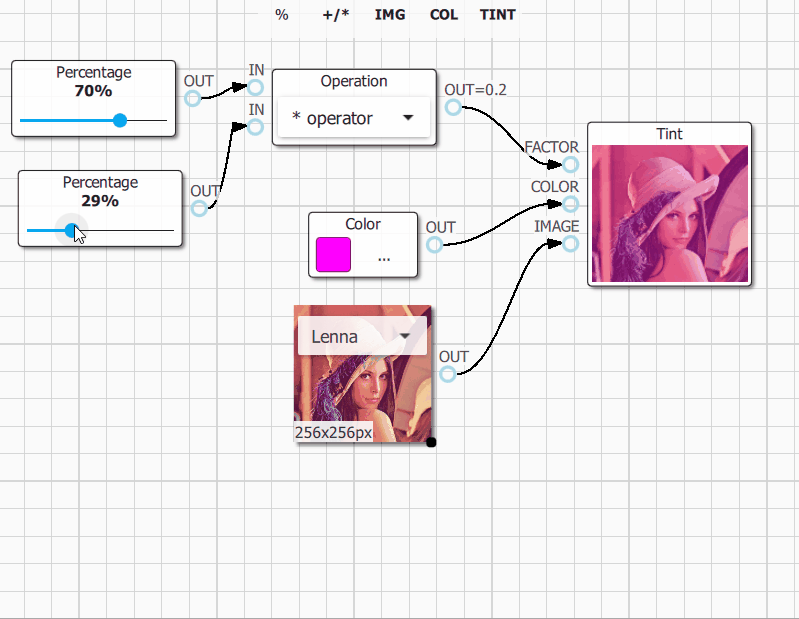
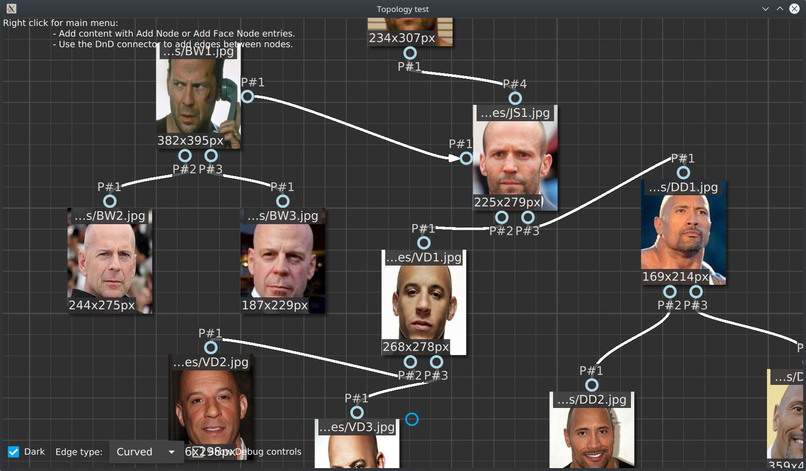

  (Linux, g++, Qt5.15, qmake)
 (Windows, msvc2019, Qt5.15, qmake)
 (Windows, msvc2019, Qt6.4, CMake)

!!! warning "QuickQanava is still alpha, but QuickQanava is already used extensively in production code."

!!! note "QuickQanava is licensed under BSD-3, specific features or support is available on demand: benoit@destrat.io"

## Introduction

`QuickQanava` is a C++14 library designed to display graphs and relational content in a QtQuick application. QuickQanava provide QML components and C++ classes to visualize medium-sized directed graphs in a C++/QML application. QuickQanava does not provide advanced layout algorithms, but rather focus on displaying relational content in advanced dynamic user interfaces (with DnD support, resizable content, visual connection of nodes).

QuickQanava main repository is hosted on GitHub: https://github.com/cneben/quickqanava

QuickQanava is primarily developed on Linux and Qt 5.15. minimal required Qt version is **Qt 5.10**.

+ Project homepage: [http://cneben.github.io/QuickQanava/index.html](http://cneben.github.io/QuickQanava/index.html)

Please refer to [Installation](installation.md) manual and [Graph](graph.md), [Nodes](nodes.md) and [Graph](edges.md) sections for more information about installing and using QuickQanava.

## Gallery

[QuickQanava samples](samples.md)

| Node Grouping                | Visual Connection of Nodes         | 
| :---:                       | :---:             | 
|  |  | 
|  |  | 

