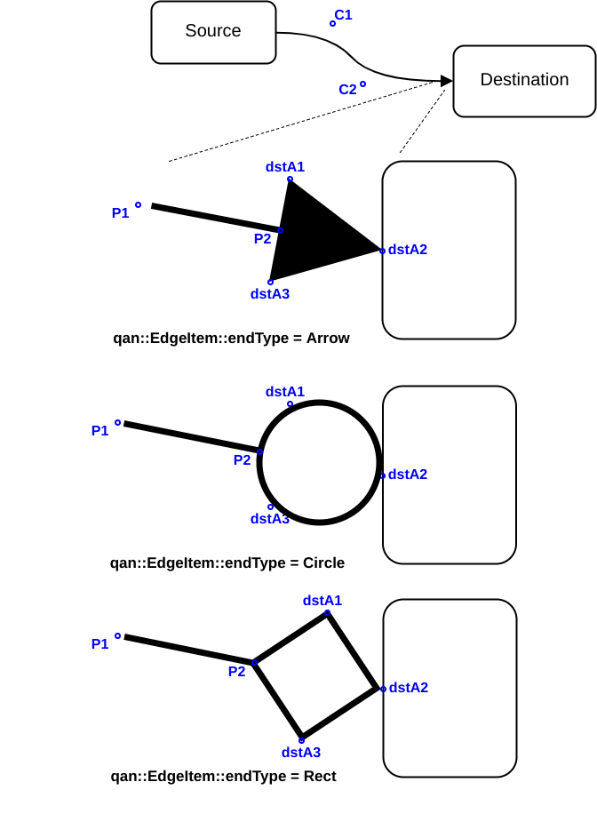

Library Internals (Contributors)
============================

Edge Geometry Management
------------------

Generating edge geometry efficiently has a critical impact on performances, since moving a single node or groups might affect geometry for _all adjacent edges_. QuickQanava strategy is to cache all edge geometry in a specific moveable `qan::EdgeItem::GeometryCache` struct, and try to minimize changes when the cache is applied to a concrete edge in `qan::EdgeItem::updateItem()` method.

Concrete visual item for the edge is a QML component inheriting from `qan::EdgeItem` (or `Qan.EdgeItem`). Default component is `Qan.Edge`, to ease creation of custom edge, the visual part of `Qan.Edge` is delegated to a "QML template", the default version is `Qan.EdgeTemplate`, it embed QtQuick.Shapes items and connect them to geometry properties in `qan::EdgeItem` (for example for "curved edges", a QtQuick.Shapes PathCubic is connected to properties `qan::EdgeItem::c1` and `c2` modelling bezier curve controls points.

- dstA1/dstA2/dstA3 are generated in `EdgeItem::generateArrowGeometry()`

Source code:

  - [qanEdgeItem.h](https://github.com/cneben/QuickQanava/blob/master/src/qanEdgeItem.h#L60)
  
