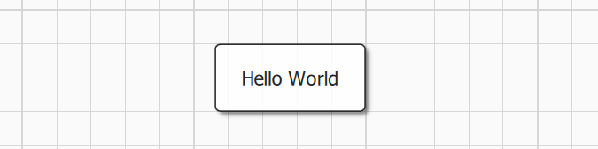
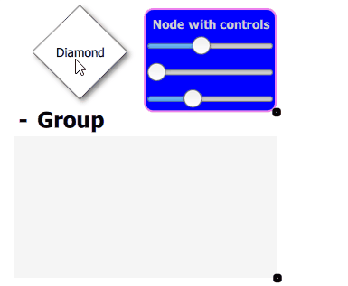
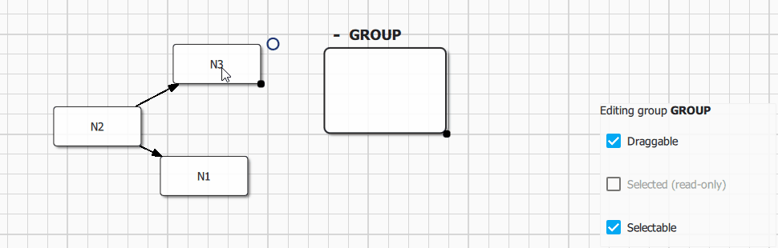

Defining Nodes
============================

Topology
------------------

### Adding content

Nodes are managed from `qan::Graph` (C++) graph or `Qan.Graph` (QML) interface. In QML, nodes are usually modified from `Qan.Graph Component.onCompleted()` function:

- `#!js Qan.Node Qan.Graph.insertNode()`: 
- `#!js Qan.Group Qan.Graph.removeNode()`:

All primitives (nodes, edges, groups) have both a "topological and data" aspect (Qan.Node, Qan.Edge, Qan.Group) and a visual counter part accessible trough their `item` property (usually a Qan.NodeItem, Qan.EdgeItem, Qan.GroupItem).

``` cpp hl_lines="5"
Qan.Graph {
    id: graph
    anchors.fill: parent
    Component.onCompleted: {
        var n1 = graph.insertNode()
        n1.label = "Hello World"			// n1 encode node topology (it's a qan::Node)
		n1.item.x = 50; n1.item.y = 50		// n1.item is n1 visual counterpart, usually a qan::NodeItem
    }
}
```



Node appearance could be tuned by changing default styles properties directly from QML with global variable `defaultNodeStyle`, see the [Style Management](styles.md) section for more options.


### Docks and Ports

Docks and ports could be used to control how an edge is connected to source and destination node:

- A dock `Qan.DockItem` is a visual group of ports. QuickQanava define 4 ports identified by their position: Qan.NodeItem.Left / Qan.NodeItem.Top / Qan.NodeItem.Right / Qan.NodeItem.Bottom.
- A port `Qan.PortItem` is a graphical item attached to a node in a specific port that could receive in edge or "emit" out edges. A dock can have multiple ports with port.type beeing either PortItem.In (only input edge), PortItem.Out (only out edge) or PortItem.InOut.

Docks and ports are managed trought the Qan.Graph interface:

- `#!js Qan.Graph.insertPort(node, orientation)`:  Insert a port on *node* at a given *orientation* and return a `Qan.PortItem`.
- `#!js Qan.Graph.bindEdgeDestination(edge, port)`: Bind an *edge* destination on a given *port*.
- `#!js Qan.Graph.bindEdgeSource(edge, port)`: Bind an *edge* source on a given *port*.

Example of port insertion and binding to existing edges:

``` cpp hl_lines="7"
Component.onCompleted: {	// Qan.Graph.Component.onCompleted()
	var n3 = graph.insertNode()
    n3.label = "N3"; n3.item.x = 500; n3.item.y = 100
    var n3p1 = graph.insertInPort(n3, Qan.NodeItem.Left);
    n3p1.label = "IN #1"

    var n3p1 = graph.insertInPort(n3, Qan.NodeItem.Top);
    n3p1.label = "OUT #1"
    var n3p2 = graph.insertInPort(n3, Qan.NodeItem.Bottom);
    n3p2.label = "OUT #2"
	
	var e = graph.insertEdge(n2, n3)
    graph.bindEdgeDestination(e, n2p3)	// Bind our edge source to node N2 port P3 (OUT #1)
    graph.bindEdgeDestination(e, n3p1)	// Bind our edge destination to node N3 port P1 (IN #1)
}
```

(Note: Port/Dock API is still subject to change after v0.9.2)


Docks could be fully customized using QML delegates and custom node items, refer to [customdocks.qml](https://github.com/cneben/QuickQanava/blob/master/samples/connector/customdocks.qml) example in connector sample.


### Node Resizing

Node resizing behaviour could be configured with the following Qan.NodeItem (or qan::NodeItem) properties:

  - `#!js Qan.NodeItem.resizable` / `#!js qan::NodeItem::setResizable()`: Enable or disable node item resizing (default to `true`, ie node is resizable).
  - `#!js Qan.NodeItem.ratio` / `#!js qan::NodeItem::setRatio()`: Set the node "allowed" resizing ratio when visual resizing is enabled. Ratio is witdh / height ratio that is allowed during visual resizing operations. Ratio conservation is disabled if `ratio` is < 0. `ratio` default to -1, ie ratio is not conserved.

``` cpp hl_lines="9"
Component.onCompleted: {	// Qan.Graph.Component.onCompleted()
	var n1 = graph.insertNode()
    n1.item.resizable = false   // n1 is not resizable
    
	var n2 = graph.insertNode()
	n2.item.resizable = true    // n2 is resizable (setting to true is 
	                            // not mandatory, it's the default behaviour)

	n2.item.ratio = 0.5  // node resizing will maintain a width/height ratio 
                         // of 0.5, ie height will alays be half of width.
}
```

Default resizer color could be configured in `Qan.GraphView` using the following properties:

- `resizeHandlerColor` (color): Color of the visual drop node component (could be set to Material.accent for example)

Node defining custom delegate resizing will be handled automatically by the framework. Complete customization of the resizing behaviour of custom nodes is possible using the `Qan.BottomRightResizer` component directly from custom delegates (See [Bottom Right Resizer](utilities.md)). 


### Observing Topology


Selection
------------------
   
Selection can be modified at graph level just by changing the graph selection policy property `Qan.Graph.selectionPolicy`:

- `#!js Qan.AbstractGraph.NoSelection`: Selection will be disabled in the whole graph.
- `#!js Qan.AbstractGraph.SelectOnClick`: Node are selected when clicked, multiple selection is enabled when CTRL is pressed.
- `#!js Qan.AbstractGraph.SelectOnCtrlClick`: Node are selected only if CTRL is pressed when node is clicked (multiple selection is still available).

Selection can also be configured with the following Qan.Graph properties:

- `#!js Qan.Graph.selectionColor` / `#!js qan::Graph::setSelectionColor()`: Color for the node selection rectangle.
- `#!js Qan.Graph.selectionWeight` / `#!js qan::Graph::setSelectionWeight()`: Border width of the node selection rectangle.
- `#!js Qan.Graph.selectionMargin` / `#!js qan::Graph::setSelectionMargin()`: Margin between the node selection rectangle and the node content (selection weight is taken into account).

All theses properties could be changed dynamically.

Selection could also be disabled at node level by setting `Qan.Node.selectable` property to `false`, node become unselectable even if global graph selection policy `Qan.Graph.selectionPolicy` is set to something else than `NoSelection`.

Current multiple selection (or single selection) is available through Qan.Graph `selectedNodes` property. `selectedNodes` is a list model, it can be used in any QML view, or iterated from C++ to read the current selection:
``` cpp hl_lines="6"
// Viewing the currently selected nodes with a QML ListView:
ListView {
	id: selectionListView
	Layout.fillWidth: true; Layout.fillHeight: true
	clip: true
	model: graph.selectedNodes		// <---------
	spacing: 4; focus: true; flickableDirection : Flickable.VerticalFlick
	highlightFollowsCurrentItem: false
	highlight: Rectangle {
		x: 0; y: ( selectionListView.currentItem !== null ? selectionListView.currentItem.y : 0 );
		width: selectionListView.width; height: selectionListView.currentItem.height
		color: "lightsteelblue"; opacity: 0.7; radius: 5
	}
	delegate: Item {
		id: selectedNodeDelegate
		width: ListView.view.width; height: 30;
		Text { text: "Label: " + itemData.label }		// <----- itemData is a Qan.Node, node 
														// label could be accessed directly
		MouseArea {
			anchors.fill: selectedNodeDelegate
			onClicked: { selectedNodeDelegate.ListView.view.currentIndex = index }
		}
	}
}
```

In C++, `selectedNodes` could be iterated directly, the current node should be tested to ensure it is non nullptr, since the underlining model is thread-safe and could have been modified from another thread:
``` cpp
	auto graph = std::make_unique<qan::Graph>();
    for ( auto& node : graph->getSelectNodes() ) {
        if ( node != nullptr )
            node->doWhateverYouWant();
    }
	// Or better:
    for ( const auto& node : qAsConst(graph->getSelectNodes()) ) {
        if ( node != nullptr )
            node->doWhateverYouWantConst();
    }
```

Example of `Qan.AbstractGraph.SelectOnClick` selection policy with multiple selection dragging inside a group:




Defining Custom Nodes
------------------

Refer to `custom.qml` file in [Nodes](https://github.com/cneben/QuickQanava/blob/master/samples/nodes/nodes.qml) sample for more information regarding configuration and installation of specifics custom delegates for nodes and edges.

When defining custom nodes with complex geometry (ie. non rectangular), there is multiple ways to take bounding shape generation into account :
  
  - Using the default behavior for rectangular node with `complexBoundingShape` set to false (default value), bounding shape is automatically generated on node width or height change in `generateDefaultBoundingShape()`.
  
  - Using dedicated code by setting `complexBoundingShape` to true and with a call to \c setBoundingShape() from a custom onRequestUpdateBoundingShape() signal handler.

Note that signal `requestUpdateBoundingShape` won't be emitted for non complex bounding shape. Optionally, you could choose to set complexBoundingShape to false and override `generateDefaultBoundingShape()` method.


Grouping Nodes
------------------

### Default Groups

Groups are a specific kind of nodes that can contains mutliple regular nodes. Groups are created using `#!js Qan.Graph.insertGroup()` method. Nodes are ususally inserted into existing groups visually by dragging and dropping a node inside a group. Group topology could also be modified from C++ using `qan::Graph::groupNode()` and `qan::Graph::ungroupNode()` API.

Group visual item (`Qan.GroupItem`) is accessible from `Qan.Group.item` property, the API is fully consistent with nodes. A group could have a custom label (editable directly from the default delegate using Quick Controls 2 text input) and could be collapsed visually using the `Qan.GroupItem.collapsed` property.



``` cpp
Qan.Graph {
  id: graph
  objectName: "graph"
  anchors.fill: parent

  Component.onCompleted: {
    var n1 = graph.insertNode()
    n1.label = "N1"
    var n2 = graph.insertNode()
    n2.label = "N2"
    var n3 = graph.insertNode()
    n3.label = "N3"
    graph.insertEdge(n1, n2)
    graph.insertEdge(n2, n3)

    var gg = graph.insertGroup();
    gg.preferredGroupWidth = 300.
    gg.preferredGroupHeight = 250.
    gg.minimumGroupWidth = 200.
    gg.minimumGroupHeight = 150.
    gg.label = "Group"
  }
} // Qan.Graph: graph
```

The following configuration options are available for `Qan.Group`:

- `Group.resizable` or `qan::GroupItem::resizable`: Enable or disable visual group resizing.
- `Group.labelEditorVisible (QML only)`: Show or hide the group label visualization and edition visual component (label is editable by default).
- `Group.expandButtonVisible (QML only)`: Show or hide the group default delegate expand/collapse button (button is visible by default).

Group sizing is managed automatically by the framework to prevent resizing group below it's content `contentsRect`. Group size **should not** be modified directly trough standard quick items `width` and `height` properties, instead use:

- `GroupItem.preferredGroupWidth` / `GroupItem.preferredGroupHeight`: Initial group size (should be used instead of setting group item width/height directly), default to (250x200).
- `GroupItem.minimumGroupWidth` / `GroupItem.minimumGroupHeight`: Group can't be resized below specified width/height, default to (150x100).

Refer to [Group Sample](https://github.com/cneben/QuickQanava/blob/master/samples/groups/groups.qml) for more detailled informations.

### Custom Groups

`GroupItem` is build using `Qan.RectGroupTemplate` template, a custom group delegate with full selection/resizing and styling support could easily be built using this template, see the [Qan.Group](https://github.com/cneben/QuickQanava/blob/425f1de0c75e1be85f51b90de517d75612978485/src/Group.qml#L42) component implementation for a demonstration.

A group visual delegate could be built completely from scratch, by inheriting a component from `Qan.GroupItem` or directly from `#!js qan::GroupItem` class, but the following interface must be configured to enable node drag and drop and complete integration in QuickQanava framework:

- `Qan.GroupItem.container` or `#!js qan::GroupItem::container` must be binded to a QuickItem acting as a group concrete container, otherwise visual drag and drop of nodes won't works (Mandatory).
- Custom group item should react to signals `onNodeDragEnter()` and `onNodeDragLeave()` when a candidate node is dragged above the group to send a visual feedback to the user (Optional).


There is a complete demonstration for a custom group component without the use of default rectangular group template in 'cpp' sample: [CustomGroup.qml](https://github.com/cneben/QuickQanava/blob/master/samples/cpp/CustomGroup.qml) and [C++ class CustomGroup](https://github.com/cneben/QuickQanava/blob/425f1de0c75e1be85f51b90de517d75612978485/samples/cpp/cpp_sample.h#L44)

