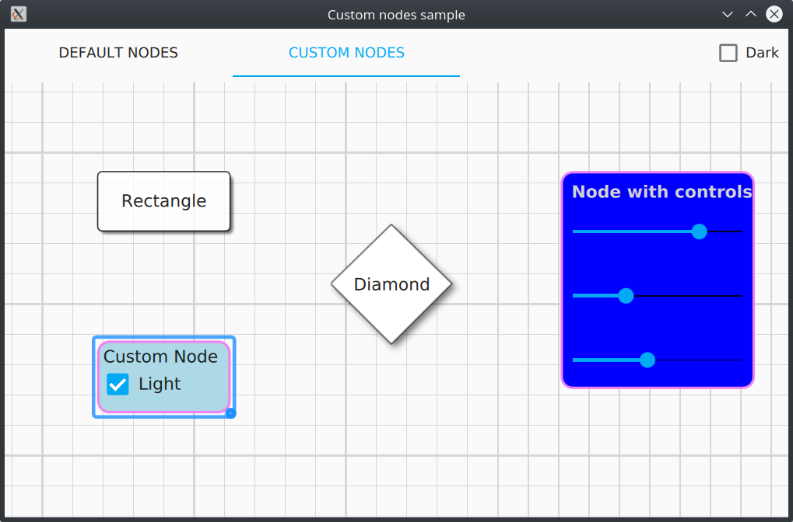
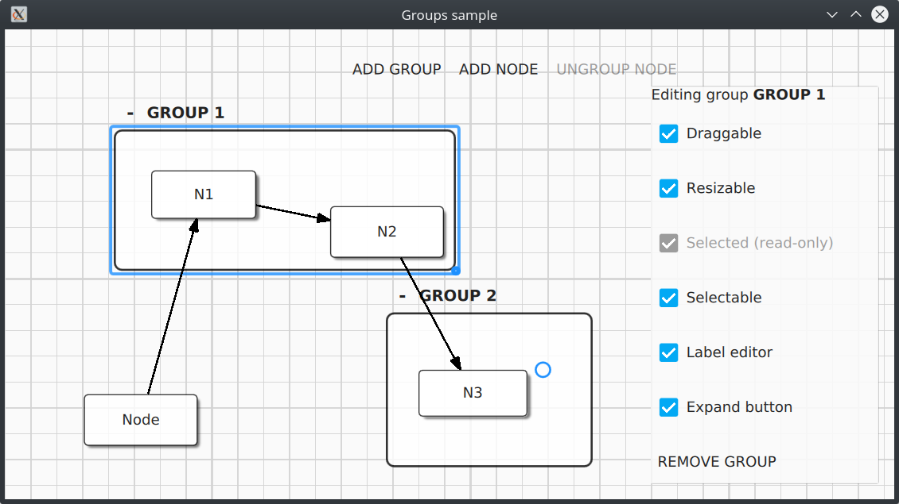
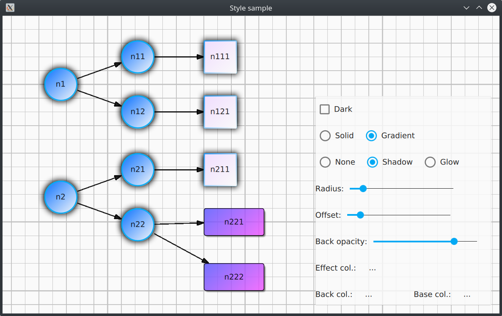

QuickQanava Samples
============================

| Feature                 | nodes                 | connector                                      | groups                   | topology                         | dataflow                  | cpp   |
| ---                     | :---:                 | :---:                                          | :---:                    | :---:                            | :---:                     | :---: |
| Visual connector        |  |  (and custom connectors) |                          |            |     |       |
| Custom visual connector |  |                                                |                          |                                  |                           |       |
| Selection               |  |                                                |   |  QML & C++ |                           |       |
| Custom nodes QML        | |                                                |                          |                                  |                           |       |
| Custom groups QML       |  |                                                |                          |                                  |                           |  |
| Custom nodes C++        |  |                                                |                          |            |     |  |
| Topology in C++         |  |                                                |                          |                                  |          |  |

Custom Nodes: 'custom'
------------------

Demonstrate:

- How to define node with custom graphic content using QuickQanava node QML templates using custom delegates and `Qan.Graph.insertNode()` calls.
- How to use custom Canvas Qt Quick item for drawing node content with `Qan.CanvasNodeTemplate` component (see `DiamonNode.qml`).
- How to use existing Qt Quick item controls in QuickQanava nodes (see `ControlNode.qml`).

Navigable Area: 'navigable'
------------------

Demonstrate use of [`qan::Navigable`](http://www.destrat.io/quickqanava/doc/classqan_1_1_navigable.html). 

Groups Management: 'groups'
------------------

Demonstrate:

- How to create groups of node using `Qan.Graph.insertNode()` calls.
- How to interact with groups by catching `Qan.Graph.groupClicked()` and `Qan.Graph.groupRightClicked()` signals.

Style Management: 'style'
------------------

Topology Sample: 'topology'
------------------

Demonstrate:

- How to use `Qan.Graph.selectionPolicy`.
- How to use custom delegates to visualize nodes and edges in a ListView with `Qan.Graph.nodes` and `Qan.Graph.edges` properties.

