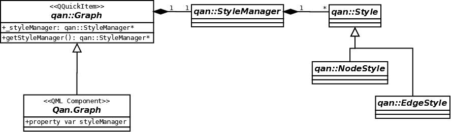
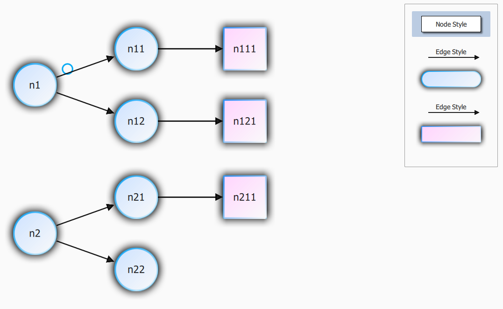

Managing Styles 
============================

Introduction
------------------

Defining Styles
------------------

Three shortcut context variables are available from QML to access default styles: `defaultNodeStyle`, `defaultEdgeStyle`, `defaultGroupStyle`.

QuickQanava provide a ready to use visual `Qan.StyleListView` component for visualizing, editing styles and dragging them visually on existing graph content. 

