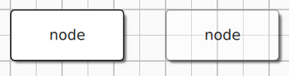
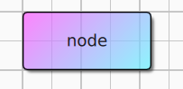
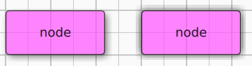
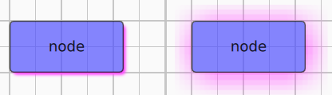
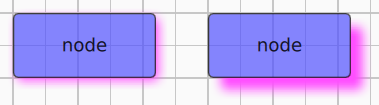

Managing Styles 
============================

Introduction
------------------


Defining Styles
------------------


Three shortcut context variables are available from QML to access default styles: `defaultNodeStyle`, `defaultEdgeStyle`, `defaultGroupStyle`.

QuickQanava provide a ready to use visual `Qan.StyleListView` component for visualizing, editing styles and dragging them visually on existing graph content. 

### Node Style

| Property        | Description                                                         |  Default            |   Sample    |
| ---             | :---:                                                               | :---:               | :---:       |
| `backRadius`    | Background rectangle border (corner) radius                         | `4.0`               |             | 
| `backOpacity`   | Background item opacity                                             | `0.85` (85% opaque) |   1.0 opacity and 0.30 opacity | 
| `fillType`      | Background fill (`NodeStyle.FillGradient` or `NodeStyle.FillSolid`) | `FillSolid`         |   `fillType=Gradient` with `baseColor` 'violet' and `backColor` 'blue'| 
| `backColor`     | Background color                                                    | `white`             |             | 
| `baseColor`     | Background color used as base (ie top-left) color in gradient fill  | `white`             |  `baseColor` 'violet' and `backColor` 'blue' | 
| `borderColor`   | Node border line color                                              | `black`             |             | 
| `borderWidth`   | Node border line width                                              | `1.0`               |             | 
| `effectType`    | Node effect, either `EffectNone`, `EffectShadow` (drop shadow) or `EffectGlow` | `Qan.NodeStyle.EffectShadow` | `effectType=EffectShadow` and `EffectGlow`| 
| `effectEnabled` | Set to false to disable effect (much more efficient than setting `effectType` to `EffectNone` | `true` | | 
| `effectColor`   | Effect color (ie drop shadow or glow effect color)                  | `darkgrey`          |  'violet' drop shadow| 
| `effectRadius`  | Effect radius                                                       | `8.0`               |  4.0 and 20.0 drop shadow radius | 
| `effectOffset`  | Effect offset (used only for `NodeStyle.EffectShadow`)              | `4.0`               |  4.0 and 15.0 drop shadow offset | 


Material
------------------

There is easy to use properties shortcuts in `Qan.GraphView` and `Qan.Graph` to bind UI elements colors to a Qt Quick Controls 2 theme. The following sample show the minimal necessary binding to support Light and Dark mode when using the Qt Quick Material style:

``` cpp
import QtQuick.Controls.Material 2.1
import QuickQanava               2.0 as Qan
import "qrc:/QuickQanava"        as Qan

Qan.GraphView {
    resizeHandlerColor: Material.accent
    gridThickColor: Material.theme === Material.Dark ? "#4e4e4e" : "#c1c1c1"
    topology: Qan.Graph {
        // ...
        selectionColor: Material.accent
        connectorColor: Material.accent
        connectorEdgeColor: Material.accent
        // ...
    } // Qan.Graph
    // ...
} // Qan.GraphView
```
