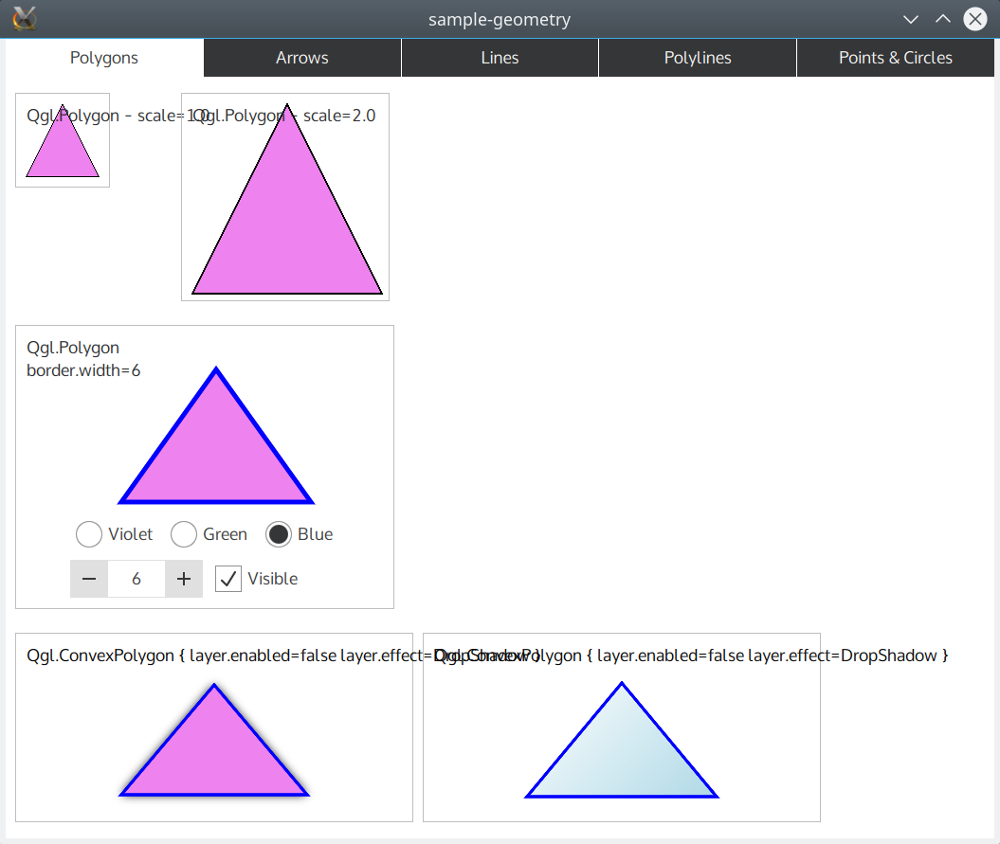
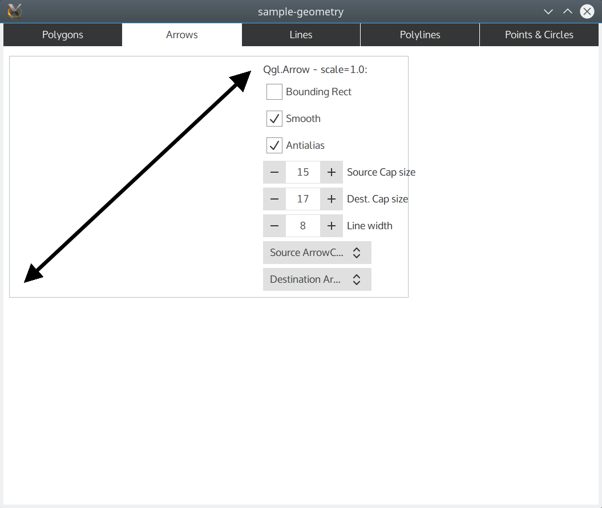

QuickQanava Utilities 
============================

BottomRightResizer:
------------------

Qan.BottomRightResizer add a "resize handler" ont the bottom right of a target QML Item. Bottom right resizer component is automatically initialized in the QuickQanava::initialize method, it has no dependencies on QuickQanava and could be used in an isolated project just by copying its source code: fqlBotomRightRizer.h and fqlBotomRightRizer.cpp with a call to qmlRegisterType< fql::BottomRightResizer >( "YourModule", 1, 0, "BottomRightResizer" );

~~~~~~~~~~~~~{.cpp}
// From c++:
qmlRegisterType< fql::BottomRightResizer >( "YourModule", 1, 0, "BottomRightResizer" );

 // From QML:
import YourModule 1.0 as Fql

Item {
    id: targetItem
    Fql.BottomRightResizer { target: targetItem }
}
~~~~~~~~~~~~~
 
Resizer not necessarilly has to be in \c target sibling, you can perfectly define the Fql.BottomRightResizer outside of target item hierarchy, for example to avoid corrupting the target childrenRect property. It is however more efficient to use the resizer as a target child (most common case).

Navigable:
------------------

[`qan::Navigable`](http://www.destrat.io/quickqanava/doc/classqan_1_1_navigable.html)

QuickGeoGL:
------------------

`QuickGeoGL` is used in QuickQanava to draw lines/polylines and convex polygon using Qt Quick items with fast OpenGL shaders. 

`QuickGeoGL` has support for:

- Lines antialiased rendered using a geometry and fragment OpenGL shader.
- Convex polygons with antialiased border and background.
- Polylines both open and closed with antialiasing using a geometry and fragment OpenGL shader.

