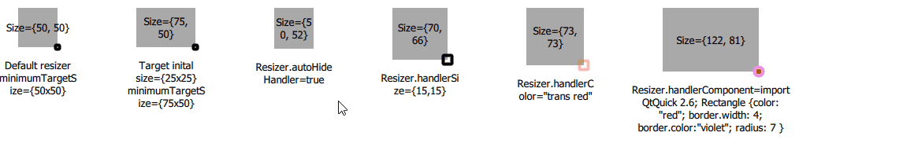

QuickQanava Utilities 
============================

BottomRightResizer:
------------------

Qan.BottomRightResizer add a "resize handler" ont the bottom right of a target QML Item. Bottom right resizer component is automatically initialized in the QuickQanava::initialize method, it has no dependencies on QuickQanava and could be used in an isolated project just by copying its source code: `qanBottomRightResizer.h` and `qanBottomRightResizer.cpp` with a call to `#!js qmlRegisterType<qan::BottomRightResizer>( "YourModule", 1, 0, "BottomRightResizer");`

~~~~~~~~~~~~~{.cpp}
// From c++:
qmlRegisterType<qan::BottomRightResizer >("YourModule", 1, 0, "BottomRightResizer");

 // From QML:
import YourModule 1.0 as Qan

Item {
    id: targetItem
    Qan.BottomRightResizer { target: targetItem }
}
~~~~~~~~~~~~~
 
Resizer not necessarilly has to be in *target* (host) sibling, `#!js Qan.BottomRightResizer` could be defined outside of target item hierarchy, for example to avoid corrupting the target `childrenRect` property. It is however more efficient to use the resizer as a target child (most common case).

Right and bottom resizer are also available, see: `qan::RightResizer` and `qan::BottomResizer`.

Navigable:
------------------

[`qan::Navigable`](http://www.destrat.io/quickqanava/doc/classqan_1_1_navigable.html)

